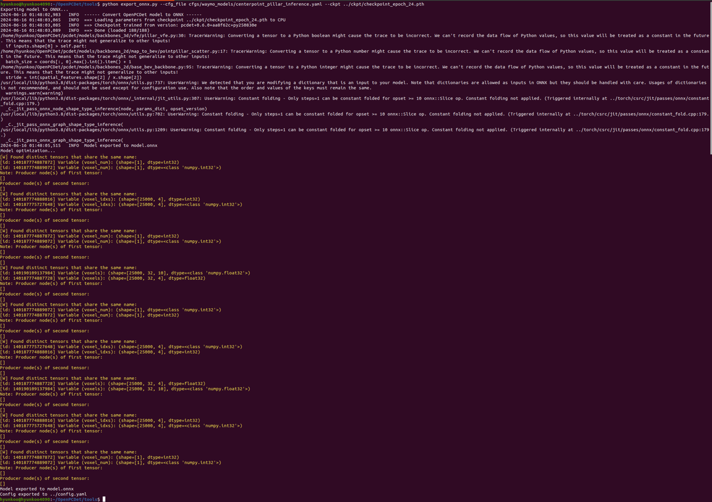
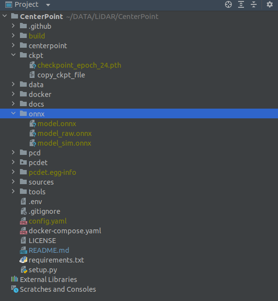

## Convert ONNX model

- Convert ONNX model file from Pytorch 'pth' model file

``` shell
docker exec -it lidar3d-RT bash

pip install onnx==1.16.0 onnxsim==0.4.36 onnxruntime

cd ~/PerceptionRT/
python tools/export_onnx.py --cfg_file {full_path/config.yaml} --ckpt {full_path/checkpoint.pth}
python tools/export_onnx.py --cfg_file /home/hyunkoo/DATA/HDD8TB/real2realAI/PerceptionRT/tools/cfgs/waymo_models/centerpoint_pillar_train_refactoring.yaml --ckpt /home/hyunkoo/DATA/HDD8TB/real2realAI/PerceptionRT/ckpt/checkpoint_epoch_24.pth
```


- As a result, create 3 onnx files on the `CenterPointPillar/onnx`
  - model_raw.onnx: pth를 onnx 로 변환한 순수 버전
  - model_sim.onnx: onnx 그래프 간단화해주는 라이브러리 사용한 버전
  - model.onnx: sim 모델을 gragh surgeon으로 수정한 최종 버전, tensorRT plugin 사용하려면 gragh surgeon이 필수임.



- Copy Onnx file to the `centerpoint/model` folder for `TensorRT` Process  
``` shell
cd ~/PerceptionRT/
cp onnx/config.yaml inference_ros2/centerpoint/config/
cp onnx/model.onnx inference_ros2/centerpoint/model/
```

## [Return to the main page.](../README.md)
