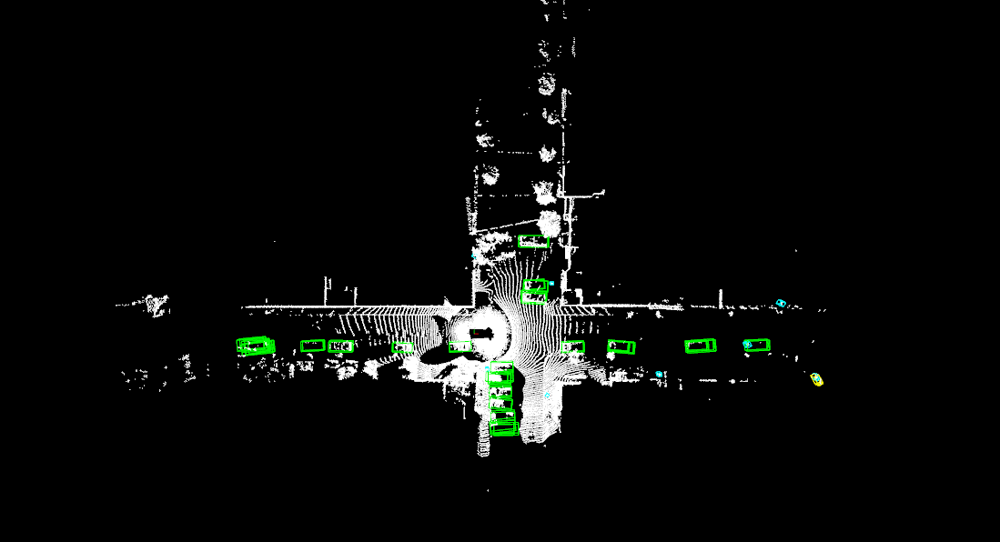

## (Python) Inference a model with TensorRT Models using Open3D and `npy files` from origin data of training dataset

## If you did not build at [Section 3_Setting_Dev_Environments](./3_Setting_Dev_Environments.md), Please build python-wrapped centerpoint for tensorRT.
``` shell
docker exec -it lidar3d-RT bash
cd ~/PerceptionRT/tools/tensorrt
cmake -BRelease && cmake --build Release
```

- Please looking for a directory with npy files in your `data` folder.
  - i.e., `./data/waymo/waymo_processed_data_v0_5_0/segment-10017090168044687777_6380_000_6400_000_with_camera_labels`. 

### Inference using `Open3D`, `npy files`, `TensorRT` on the container
```
docker exec -it lidar3d-RT bash
cd /PerceptionRT
python tools/visualization/open3d_viz_tensorRT_dataNPY.py --onnx_dir {fullpath_with_config_and_onnx} --npy_dir {fullpath_with_npy_files}
python tools/visualization/open3d_viz_tensorRT_dataNPY.py
python tools/visualization/open3d_viz_tensorRT_dataNPY.py --onnx_dir ./onnx --npy_dir ./data/waymo/waymo_processed_data_v0_5_0/segment-10017090168044687777_6380_000_6400_000_with_camera_labels
python tools/visualization/open3d_viz_tensorRT_dataNPY.py --onnx_dir /home/lidar3d/PerceptionRT/onnx --npy_dir /home/lidar3d/PerceptionRT/data/waymo/waymo_processed_data_v0_5_0/segment-10017090168044687777_6380_000_6400_000_with_camera_labels
```



## [Return to the main page.](../README.md)
